# MyWatch

A personal movie and TV show tracker. Search titles, browse by actor or director, build your watchlist, and keep track of what you've watched — all without needing an account.

**Live Demo →** [mywatch.vercel.app](https://my-watch-seven.vercel.app)

---

## Features

- **Search** by title, actor, or director — powered by TMDB
- **Person pages** — click any actor or director to see their full filmography
- **Watchlist** — add, remove, and mark titles as watched
- **Personal notes** — attach a note to any title in your watchlist
- **Filter & sort** — by type (movie/series), status (watched/unwatched), release year, or title
- **Search within watchlist** — find a specific title without scrolling
- **HD backdrop images** on every detail page
- **Watchlist count badge** on the nav — always visible
- **Share links** — copy a direct link to any title
- **Keyboard shortcut** — press `/` anywhere to focus the search bar
- **Responsive** — works on desktop, tablet, and mobile
- **Persistent** — watchlist saved in localStorage, survives page refreshes

---

## Tech Stack

| Layer | Technology |
|---|---|
| Framework | React 18 |
| Styling | Tailwind CSS |
| Routing | React Router v6 |
| State | Context API + useReducer |
| Movie Data | OMDb API |
| Images & Search | TMDB API |
| Build Tool | Vite |
| Deployment | Vercel |

---

## Getting Started

### Prerequisites
- Node.js 18+
- An [OMDb API key](https://www.omdbapi.com/apikey.aspx) (free)
- A [TMDB API access token](https://www.themoviedb.org/settings/api) (free)

### Setup

```bash
# Clone the repo
git clone https://github.com/aashwinshukla/MyWatch.git
cd MyWatch

# Install dependencies
npm install

# Create environment file
cp .env.example .env
```

Add your keys to `.env`:
```
VITE_OMDB_API_KEY=your_omdb_api_key_here
VITE_TMDB_ACCESS_TOKEN=your_tmdb_access_token_here
```

```bash
# Start the dev server
npm run dev
```

Open `http://localhost:5173`

---

## Project Structure

```
src/
├── api/
│   ├── omdb.js          # Movie data — search, details
│   └── tmdb.js          # Search, person data, backdrop images
├── components/
│   ├── layout/
│   │   ├── Header.jsx
│   │   ├── Footer.jsx
│   │   └── PageWrapper.jsx
│   ├── ui/
│   │   ├── MovieCard.jsx
│   │   ├── PersonCard.jsx
│   │   ├── SearchBar.jsx
│   │   └── LoadingSpinner.jsx
│   └── ScrollToTop.jsx
├── context/
│   └── WatchlistContext.jsx
├── hooks/
│   └── useDebounce.js
├── pages/
│   ├── Home.jsx
│   ├── Search.jsx
│   ├── Watchlist.jsx
│   ├── TitleDetail.jsx
│   ├── PersonDetail.jsx
│   └── NotFound.jsx
└── utils/
    ├── storage.js
    └── randomQuery.js
```

---

## API Usage

**OMDb** — used for movie and show detail pages (plot, cast, ratings, awards)

**TMDB** — used for:
- Search (supports actors, directors, fuzzy matching)
- Person details and filmography
- HD backdrop images on detail pages

Both APIs are free tier. Rate limits apply.

---

## Screenshots

### Desktop

| Home | Search |
|------|--------|
| 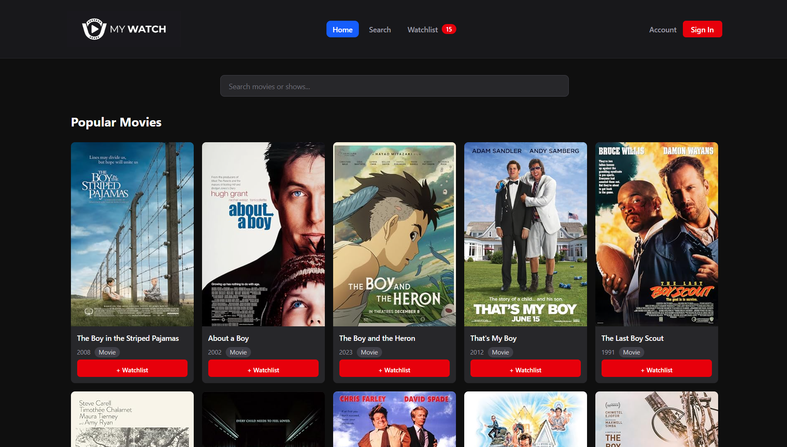 | 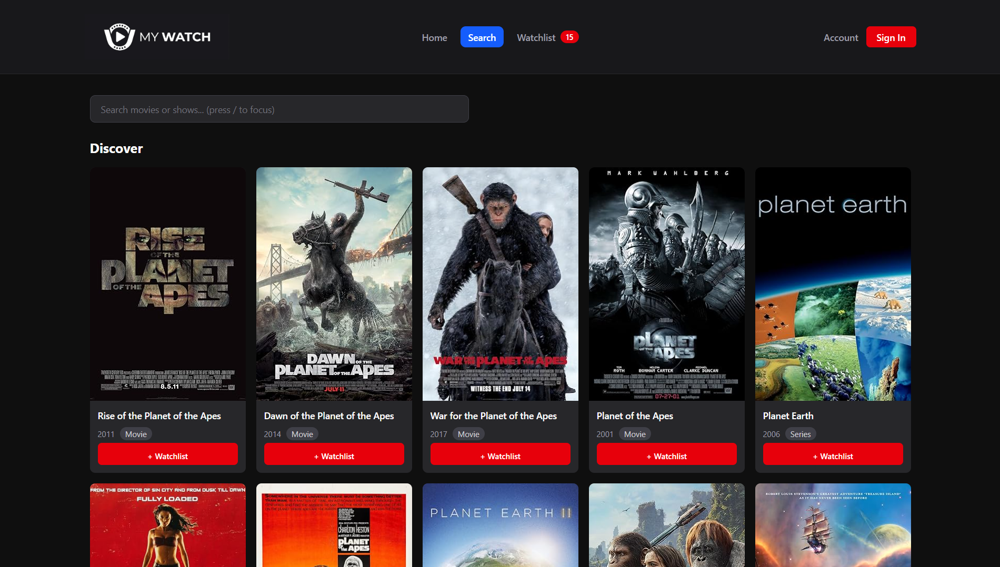 |

| Watchlist | Person Page |
|-----------|-------------|
| 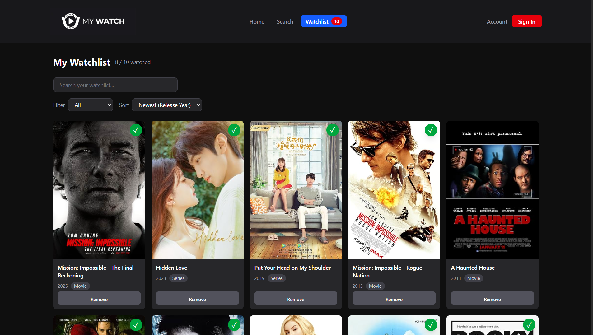 | 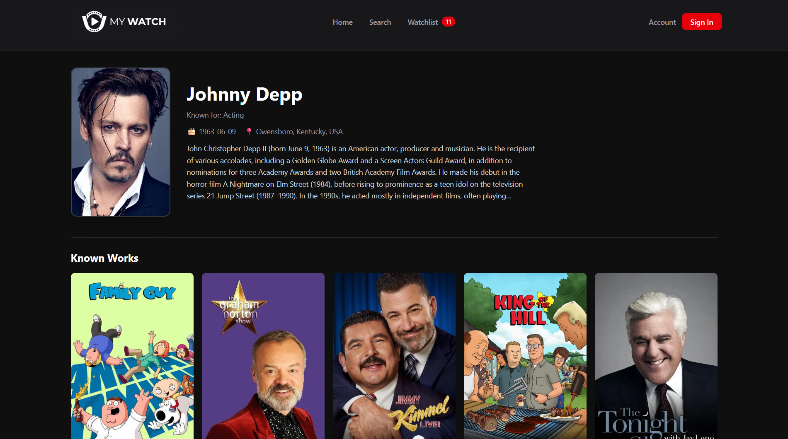 |

| Title Detail — Harry Potter | Title Detail — Harry Potter 2 |
|-----------------------------|-------------------------------|
| 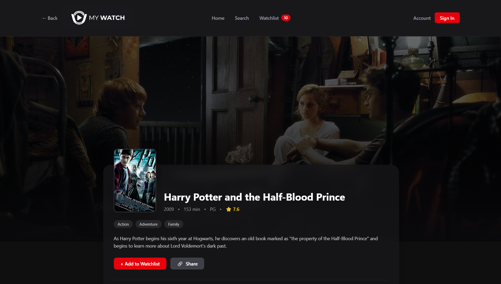 | 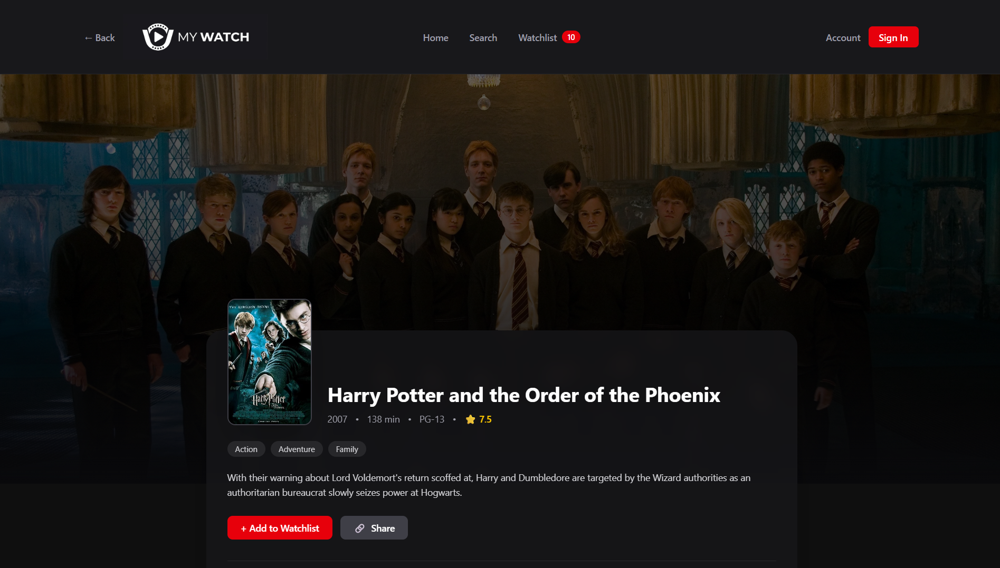 |

| Title Detail — World War Z | Title Detail — Never Have I Ever |
|----------------------------|----------------------------------|
| 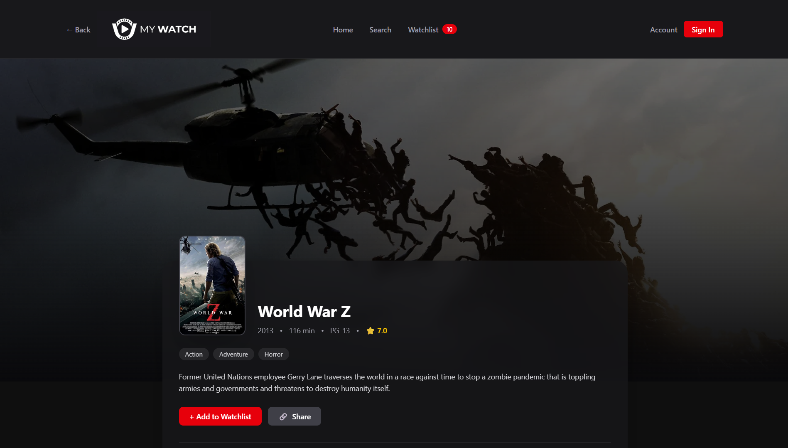 | 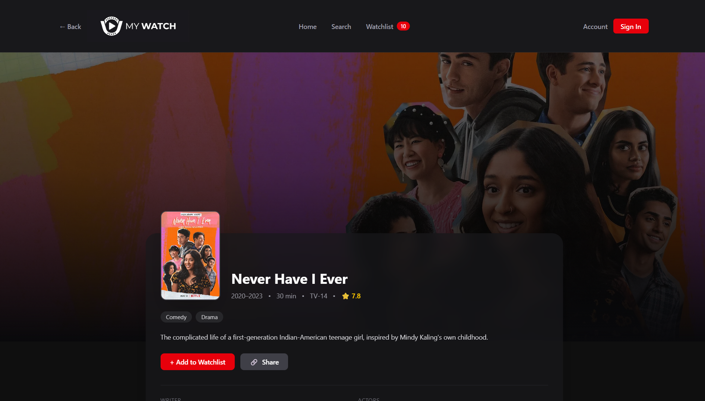 |

---

### Mobile

| Home | Menu | Person Search |
|------|------|---------------|
| 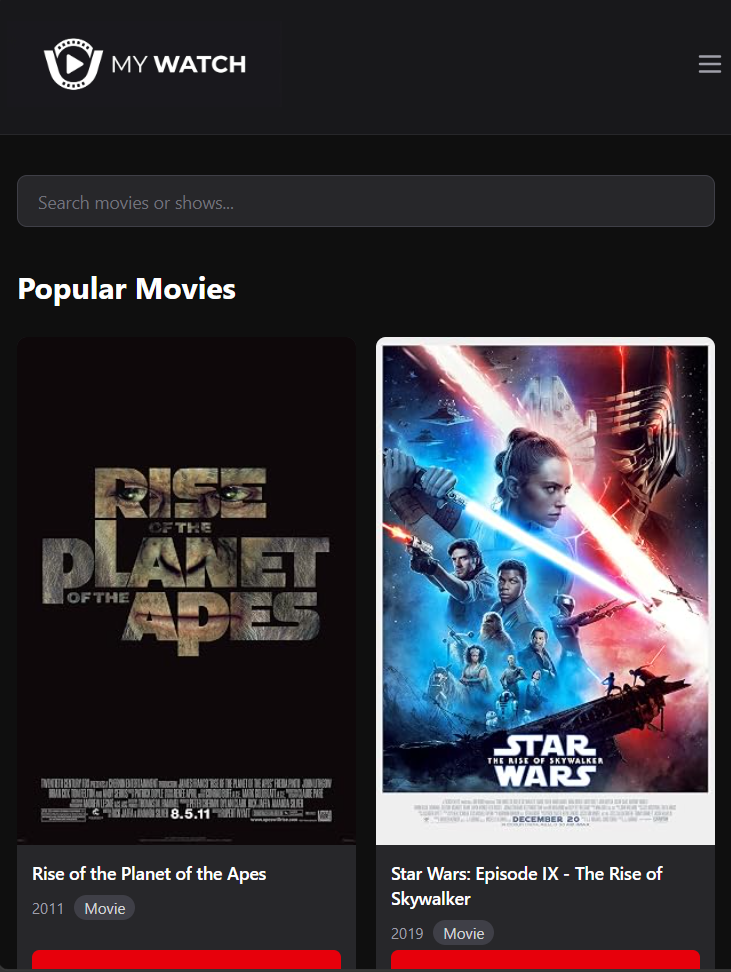 | 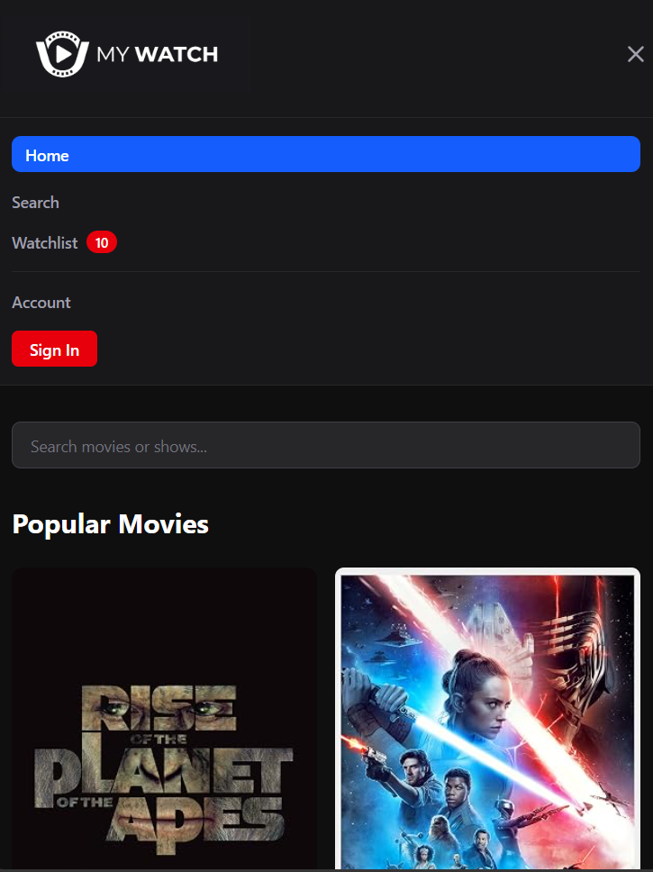 | 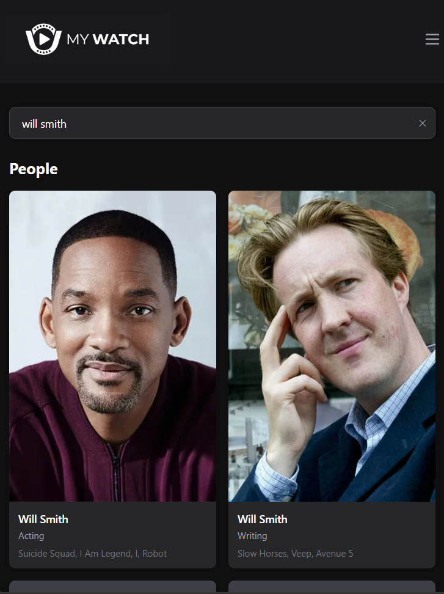 |

| Person Detail | Title Detail |
|---------------|--------------|
| 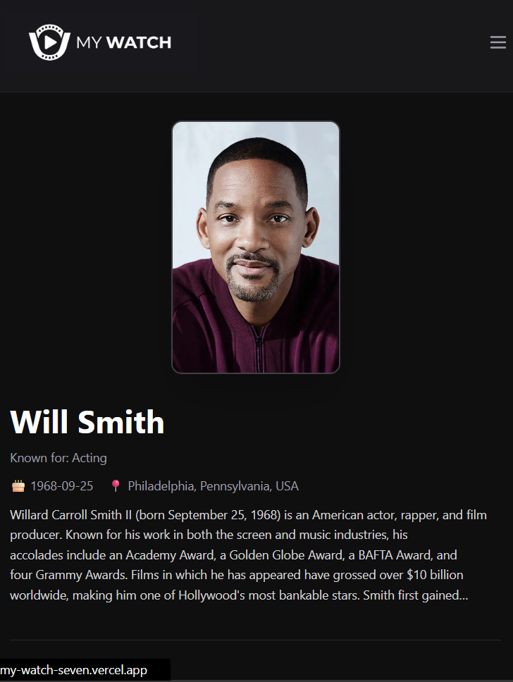 | 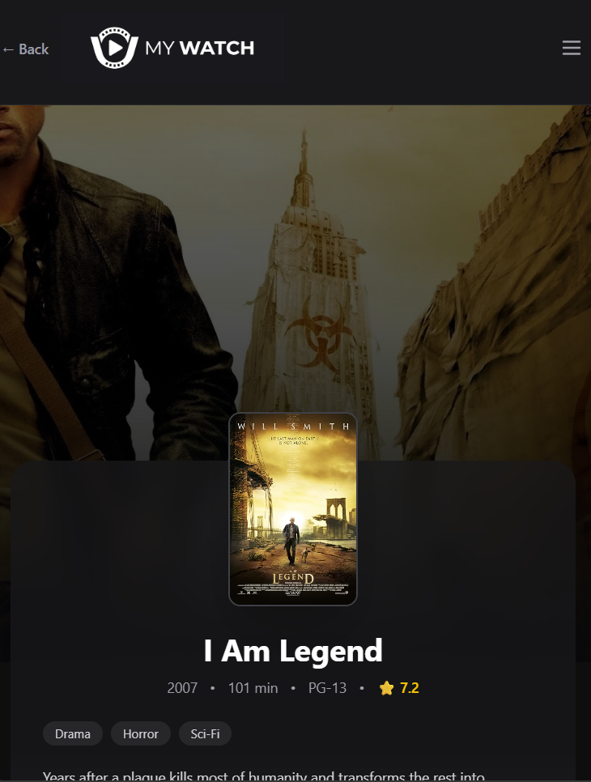 |

---

## License

MIT — see [LICENSE](./LICENSE)

---

## Acknowledgments

- Movie and show data provided by [OMDb API](https://www.omdbapi.com/)
- Search, person data, and backdrop images from [TMDB](https://www.themoviedb.org/)
- This product uses the TMDB API but is not endorsed or certified by TMDB
